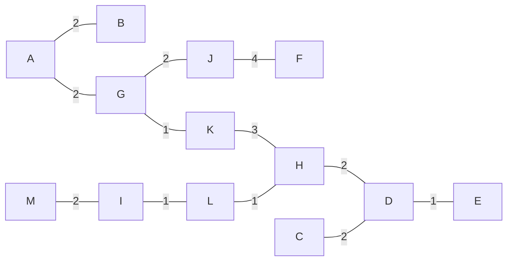

# 2015-16

## 1

- a)
Estratégia gananciosa poderia passar por colocar um cartaz e colocar o próximo cartaz a mais de 5km
```cpp
int pos[n];
int valor[n];
int total = valor[0];
int anterior = pos[0];

for (int i = 1; i < n; i++){
    if (anterior + 5 >= pos[i]){
        total += pos;
        anterior = pos[i];
    }
}
```

Complexidade O(n).
O algoritmo não é ótimo pois apenas tem em conta as distâncias entre cada posição e não os valores a cobrar.

## 2

- a)
Algoritmo de Dijkstra

|   | A | B | C | D | E | F | G |
|---|---|---|---|---|---|---|---|
| A | 0 |   | 8 |   | 7 |   |   |
| C | 0 | 12| 8 | 9 | 7 |   |   |
| E | 0 | 12| 8 | 9 | 7 | 17|   |
| D | 0 | 10| 8 | 9 | 7 | 13| 18|
| B | 0 | 10| 8 | 9 | 7 | 13| 18|
| F | 0 | 10| 8 | 9 | 7 | 13| 16|
| G | 0 | 10| 8 | 9 | 7 | 13| 16|

- b)

```
for each v ∈ V
    custo(v) <- inf
    paht(v) <- nil
gasolina = 10
custo(A) = 10 * preco(A)
Q = ∅ //min-priority queue
insert(Q, A)
while (Q != {})
    v <- extract_min(Q)
    for each w ∈ Adj(v)
        if gasolina < weight(v, w) //verifica se é necessário abastecer
            if custo(w) > custo(v) + 10*preco(w)
                gasolina += 10
                custo(w) = custo(v) + 10*preco(w)
                gasolina -= weight(v, w)
                path(w) = v
                if w ∉ Q
                    insert(Q, w)
                else
                    decrease-key(Q, w)
        else
            if custo(w) > custo(v)
                custo(w) = custo(v)
                gasolina -= weight(v, w)
                path(w) = v
                if w ∉ Q
                    insert(Q, w)
                else
                    decrease-key(Q, w)
```

- c)
Tratando-se de um grafo dirigido, contém caminho de euler entre A e G uma vez que estes são os únicos que não têm o mesmo grau de entrada e saída.

A C B D F E D B A E F G C D G 

## 3

- a) Árvore de expansão mínima pelo algoritmo de Prim.



- b)
```
Build first MST
L = list of edges in the first mst, sorted by weight
second_best_cost = INF
for (i=0; i<L.size; i++) {
    try to build a mst without using edge L[i]
    if it's possible and its cost is < second_best_cost {
        second_mst = the new found mst
        second_best_cost = its cost
    }
}
```
[Source](https://www.quora.com/How-do-I-find-the-second-best-minimum-spanning-tree/answer/Alvaro-Pereira)

## 4

- a) Não, o fluxo máximo da rede é de 10.

- b) O fluxo máximo continuaria a ser o mesmo.

- c) 

## 5

- a) a, A, b, B, c, C, d, D, E são 9 diferentes carateres. Com 3 bits apenas é possível representar 8.

- b) a - 7; A - 3; b - 5; B - 2; c - 5; C - 2; d - 8; D - 2; E - 5

Agrupando resulta em:
| frequência| número de carateres com essa frequencia| tamanho|
|:-:|:-:|:-:|
| 2| 3| 4|
| 3| 1| 4|
| 5| 3| 3|
| 7| 1| 3|
| 8| 1| 2|

Número de bits: 2 * 3 * 4 + 3 * 4 + 5 * 3 * 3 + 7 * 3 + 8 * 2 = 118


- c)
RLE: \*a5\*b3CC\*d5\*E5DDd\*A3abcddbaBB\*c4 
Os custos da utilização do algoritmo de compressão RLE são sempre associados ao número de vezes que um carater se repete sucessivamente ao longo de uma string. Caso não hajam muitos carateres a repetirem-se o resultado não será muito vantajoso. 
Codificação de tamanho fixo: 4*39 bits necessários = 156 que é bastante superior aos 118 que são utilizados quando é utlizada a codificação de Huffman. 


## 6

- a) Será possível atender um número de pedidos superior a k num minuto?

- b) O problema é NP-Completo (logo não resolúvel em tempo polinomial), pois:
    - É NP, pois é possível verificar se o número de pedidos atendidos por minuto é superior a k em tempo polinomial.
    - É NP-difícil, pois o problema é redutível em tempo polinomial ao problema da Soma dos subconjuntos, pois pretende-se encontrar o conjunto de ficheiros cujo tamanho somado seja k (largura da banda).
