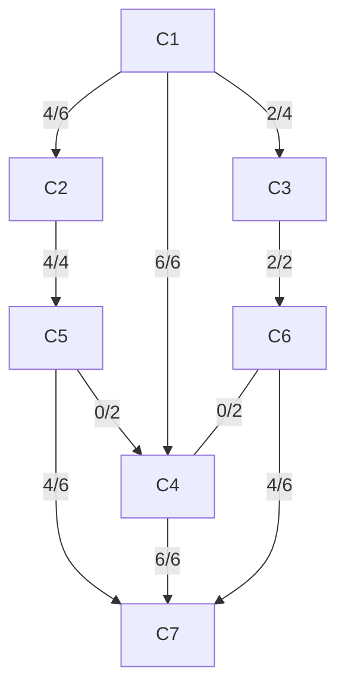
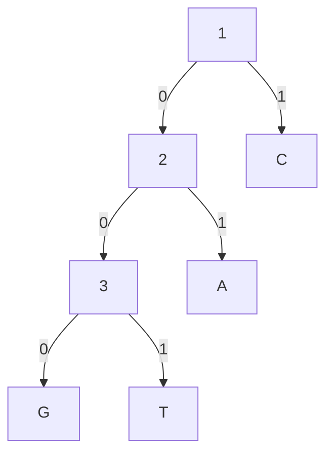

# 2016-17

## 1

- a) Estratégia gananciosa: colocar um número máximo de livros em cada prateleira. O(n)

```cpp
int total_livros = ?;
int altura = 0;
int largura = 0;
int altura_total = 0;

for (int i = 0; i < total_livros; i++){
    if (largura + L[i] <= LP){
        largura += L[i];
        if (A[i] > altura)
            altura = A[i];
    }
    else {
        total_altura += altura;
        altura = A[i];
        largura = L[i];
    }
}
```

- b) Programação dinâmica. 

Formulação recursiva de Custo[i]: 

Custo[i] =
| A[i], se i=n
| max(A[i], …, A[n]), se i < n e L[i]+ ….+ L[n] <= LP
| min{max(A[i], …, A[j]) + Custo[j+1] | j = i+1, …, n-1 e L[i]+ …+L[j] <= LP}, se i < n e L[i]+….+L[n] > LP

```cpp
Custo[n] = A[n];
soma_L_i_n = L[n];
max_A_i_n = A[n];
int i = n-1;

for ( ; i > 0 && soma_L_i_n + L[i] <= LP; i--) {
    soma_L_i_n += L[i];
    max_A_i_n = max(A[i], max_A_i_n);
    Custo[i] = max_A_i_n;
}
for ( ; i > 0; i--) {
    soma_L_i_j = L[i];
    max_A_i_j = A[i];
    Custo[i] = A[i] + Custo[i+1];
    for (int j = i+1; j < n && soma_L_i_j + L[j] <= LP; j++) {
        soma_L_i_j += L[j];
        max_A_i_j = max(A[j], max_A_i_j);
        Custo[i] = min(Custo[i], max_A_i_j + Custo[j+1]);
    }
}
return Custo[1]; 
```

## 2

- a) Caminho: ABCEF

|   | A | B | C | D | E | F | G |
|---|---|---|---|---|---|---|---|
| A | 0 | 1 | 3 |   |   | 10|   |
| B | 0 | 1 | 2 | 8 | 6 | 10| 3 | 
| C | 0 | 1 | 2 | 8 | 5 | 10| 3 |
| G | 0 | 1 | 2 | 8 | 5 | 10| 3 |
| E | 0 | 1 | 2 | 7 | 5 | 7 | 3 |
| D | 0 | 1 | 2 | 7 | 5 | 7 | 3 |
| F | 0 | 1 | 2 | 7 | 5 | 7 | 3 |

- b)

Aplicar o algoritmo de Djikstra de vi a vf e vf a vk.
Grafo dirigido acíclicos: baseados em ordenação topológica, O(|V|+|E|)

## 3

- a) Ponto D (caso seja removido é impossível alcançar os pontos a, c, f partindo de qualquer outro ponto)

- b)
    - Passo 1: vértices de grau ímpar -> d, e
    - Passo 2: caminho mais curto entre vértices de grau ímpar  (6)
    - Passo 3/4/5: adicionar aresta duplicada entre d,e.
    - Possível caminho: d, a, c, f, d, b, e, d, e, g, d
    - Qualquer percurso de Euler (percurso que passa em todas as arestas e começa e acaba no mesmo vértice) encontrado é um exemplo de um percurso ótimo do carteiro chinês. 

## 4

- a) Cálculo do fluxo máximo



Resulta um fluxo total máximo de 12 (12000 veículos por hora).

- b) C1 - C4, é o que apresenta maior fluxo. Igual a C4 - C7 no entanto caso se opte por outra solução poderá não ter o mesmo valor máximo.

## 5

A A G G T A C C T A C C C C C C C C C C C A (5 A’s, 13 C’s, 2 G’s, 2 T’s)

- a) 4 símbolos diferentes -> Representação em 2 bits para cada elemento. Código XPTO tem 22 elementos * 2 bits = 44 bits.

- b) 
Codificação obtida pelo algoritmo de Huffman:

C=1; A=01; G=000; T=001 que resulta em 13 + 2x5 + 3x2 + 3x2 = 35 

## 6

- a) Reformulação: É possível marcar os exames utilizando k ou menos slots, de forma a não haver exames sobrepostos?

- b) O problema é NP-Completo (logo não resolúvel em tempo polinomial), pois:
    - É NP, pois uma marcação candidata pode obviamente ser verificada em tempo polinomial. Basta (i) verificar se o nº de slots é efetivamente <= k e (ii) ercorrer a lista de estudantes e verificar se algum estudante tem 2 exames marcados no mesmo slot.
    - É NP-difícil, pois o problema da Coloração de Grafos é redutível em tempo polinomial ao problema da Marcação de Exames:
        - Dado um grafo G=(V,E), cada vértice é convertido num curso e cada aresta é convertida num estudante que está inscrito nos 2 cursos correspondentes aos vértices ligados pela aresta;
        - Os slots da solução do problema da marcação de exames correspondem a cores no problema da coloração de grafos;
        - Assim, 2 vértices ligados por uma aresta em G originam 2 cursos com um estudante em comum, logo terão slots de exame distintos, a que corresponderão 2 cores diferentes nos vértices de G.
        - Assim, é possível colorir os vértices do grafo com k ou menos cores, se e só se for possível marcar os exames em k ou menos slots.

    