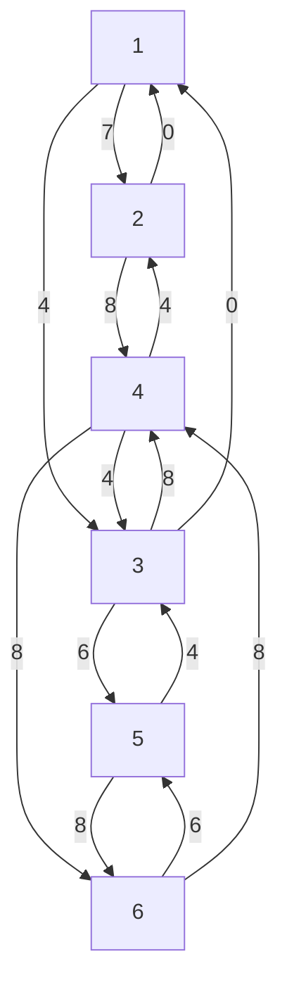

# 2017-18

## 1

- a) 
Fórmula de recorrência: m(i)
    - 0, i=j
    - min(f<sub>i,j</sub> + m(j)), i < j < n

- b)
Complexidade Temporal: O(n<sup>2</sup>)
Complexidade Espacial: O(n)
```cpp
int n = ?;
for (int i = 0; i < n; i++){
    m[i] = f[i][0];
    for (int j = 0; j < n; j++){
        m[i] = min(m[j], m[i] + f[i][j]);
    }
}
```
## 2

- a)


- b) 
Custo mínimo: 18

|   | 1 | 2 | 3 | 4 | 5 | 6 |
|---|---|---|---|---|---|---|
| 1 | 0 | 7 | 4 |   |   |   |
| 2 | 0 | 7 | 4 | 15|   |   |
| 3 | 0 | 7 | 4 | 12| 10|   |
| 4 | 0 | 7 | 4 | 12| 10| 20|
| 5 | 0 | 7 | 4 | 12| 10| 18|
| 6 | 0 | 7 | 4 | 12| 10| 18|

- c)
Interpretar como um grafo dirigido acíclico. Deste modo o problema apenas se tratará de um problema de ordenação topológica com custo O(|V|+|E|).

## 3

- a) 

- b) Fluxo máximo resultante seria o mesmo, a única diferença seria a capacidade de armazenamento dos depósitos que poderia precisar de ser alterada.

- c) Seria o mesmo, pois o valor utilizado (1) continua a ser inferior a 2.5

## 4

- a) Será possível realizar o rally de forma a que a distância de deslocações entre provas seja menor que k?

- b) O problema é NP-Completo (logo não resolúvel em tempo polinomial), pois:
    - É NP, pois é possível verificar se o valor da distância de deslocamento entre provas é menor que k em tempo polinomial.
    - É NP-difícil, pois este problema é redutível em tempo poliniomial ao problema do caixeiro viajante - encontrar um valor menor que k num grafo onde os vértices representam os locais de prova, passando por todos os vértices.